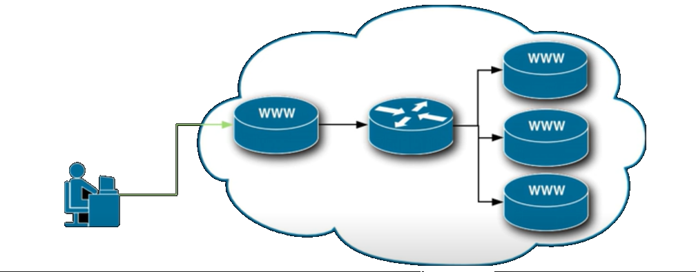
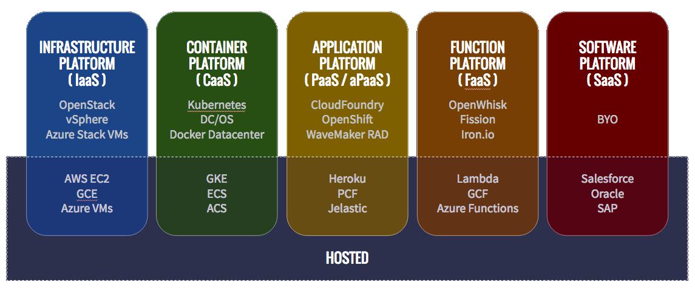

# Cloud Terminology

## Before Cloud

* **Data Center:** A large group of networked computer servers used for the remote storage, processing, and distribution of large amounts of data.

* **On-Prem:** On premise servers. Essentially, they are located on the premises of the person or organization using them.

### Multi-Tier Architecture of Client-Server Applciations:

| Tier                          | Functionality                                                       |
|-------------------------------|---------------------------------------------------------------------|
| *Presentation Tier*           | Manages the GUI of a given system.                                  |
| *Application/Processing Tier* | Executes code and processes data.                                   |
| *Data Tier*                   | Consists of persistent data storage and handling data input/output. |

## Cloud

The *cloud* is a *data center* that is managed by a provider, which allows for *serverless architecture* such as **FaaS** or **BaaS**. It arose as a result of *virtualization*.

### Defintions

* **Serverless Architecture:** The practice of hosting applications without server software or hardware management.

* **Virtualization:** The process of running a virtual instance of a computer system in a layer abstracted from actual hardware. It is more commonly referred to when running multiple operating systems on a computer system simutaneously. 

* **API Proxy:** An HTTP endpoint, such as a *data server* or *data farm*, that allows decoupling between frontend and backend services through routing calls. The proxy is shown in the center of the image below.

* **API Gateway:** An API Proxy that provides advanced features, such as authentication and input validation, in addition to routing services. It was an essential development towards implementing *cloud* business models.

## Cloud-Based Business Models

| Name                                 | Service |
|--------------------------------------|---------|
| *SaaS (Software as a Service)*       | Replica software applications are  hosted by a cloud provider.|
| *BaaS (Backend as a Service)*        | The server-side logic and state are hosted by a cloud provider.|
| *PaaS (Platform as a Service)*       | The platform upon which server-side logic and state can be specified is hosted by a cloud provider.|
| *IaaS (Infrastructure as a Service)* | The base infrastructure upon which most of the software and hardware back-end can be specified is hosted by a cloud provider.|
| *CaaS (Container as a Service)*      | A form of container-based virtualization. The container engines, orchestration, and underlying compute resources are provided to users by a cloud provider. |
| *FaaS (Function as a Service)*       | Allows for business logic to be processed by event-triggered containers that are dynamically allocated and ephemeral in nature.|

### Examples

### Definitions

  * **Event-Triggered:** The application doesn't need to be running and waiting for a request. Instead, the application will be triggered when a manually defined event occurs.

  * **Containers:** Provides the runtime environment for user code.

  * **Dynamic:** The cloud provider provides resources and memory dynamically, depending on the number of requests being made.

  * **Ephemeral:** Once the work of a container is complete, the container will dissapear and not take up system resources.
