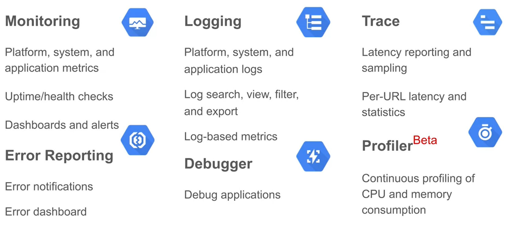

# Google Cloud Development

## Cloud Source Repository

**Cloud Source Repository** is GCPs code repository service that uses *Git Version Control*. 

### Features

* Code Privacy per Project 

* IM Protections

* Git instances will be automatically maintained.

* Has a source viewer that makes it possible to browse through and view files in the GCP console.

- - - -

## Cloud Datalab

*Cloud Datalab* is a Python notebook software, similar to *Jupyter Notebook*, available through cloud services.

### Features

* Uses Google's *Project Jupyter* to create and maintain web-based Python notebooks.

* *Cloud Datalab* uses Compute Engine VMs for processing power. These type and region of these VMs can be specified.

* Integrated with BigQuery, Compute Engine, and Cloud Storage.

* Can visualize data using MatPlotLib or Google Charts.

* Provides many existing packages for statistics, machine learning, visualization, and more. 

- - - -

## Cloud Functions

Uses *FaaS* architecture. Allows developers to create single-purpose functions that respond to events without having to define a server or runtime. 

### Features

* __Requirements:__ The function needs to be typed in JS to be used by a Node.js, Python, or Go runtime provided by GCP. Additionally, the functions have a timeout limit of 60 seconds.

* The function can be set up to respond to **Cloud Storage** events, **Cloud Pub/Sub** events, or HTTP calls.

* Provides automatic scaling depending on how often the function is called.

* Provides temporary storage in a local disk: __/tmp__

* The developer only needs to pay each instance the function is run.

- - - -

## Google Operations 

GCP's tool for monitoring, logging, and diagnostics. It gives the developer access to many types of signals from:

* Infrastructure Platforms
* Virtual Machines
* Containers
* Middleware
* Application Tier
* Logs
* Metrics
* Traces

**Google Operations** offers capabilities in 6 major areas:

