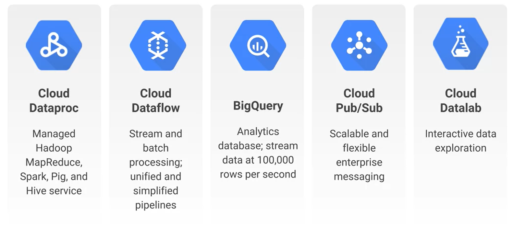

# BigData

Google Cloud *BigData* services use an **Integrated Serverless Platform**. This means developers don't have to concern themselves with provisioning compute instances; the resources are fully managed and the developer only pays for the resources he/she consumes.

- - - -

## Cloud Dataproc

**Cloud Dataproc** is a cloud service for running **Apache Hadoop**, which is an open-source framework based on the *MapReduce* programming model that Google invented and published. The model involves using a *map* function that runs in parallel to produce intermediate results and a *reduce* function that builds a final result based on the intermediate results.

### Features

* Running **Hadoop**, **Spark**, **Hive**, and **Pig** simply involves requesting a Hadoop cluster that will be built in 90 seconds or less.

* The developer can control the VM count and type. Compute power can also be scaled up and down while a cluster is running, based on the developer's need.

* Clusters are billed in one-second clock-time increments. Preemptible VMs can be specified for much cheaper service costs.

* Once the data is in a cluster, **Spark** and **Spark SQL** can be used for data mining; **MLlib** can be used to discover patterns through machine learning.

* Clusters can be monitored through **Google Operations**.

- - - -

## Cloud Dataflow

**Cloud Dataflow** is a general purpose *ETL* tool that is a great choice when dealing with real-time data that is of an unpredictable rate or size.

### Features

* Used to create data pipelines similar to *MS SSIS*. The pipelines work for batch and streaming data.

* Completely automates operational tasks such as resource management and performance optimization.

* Can orchestrate internal and external services, which allows it to be used in real-time applications.

- - - -

## BigQuery

**BigQuery** is a fully-managed, petabyte-scale, low-cost analytics warehouse. 

### Features

* Ad-hoc *SQL* queries use Google's processing power to run extremely fast.

* Can easily read and write data via **Cloud Dataflow**, **Hadoop**, and **Spark**> 

* Data can be loaded from **Cloud Storage**, **Cloud Datastore**, or streamed in at 100,000 rows per second.

* Free monthly quotas.

* The region data storage can be specified.

* **BigQuery** separates storage and computation, queries cost money only when they're running.

* The data can be shared with developers in different GCP projects.

- - - -

## Cloud Pub/Sub

**Cloud Pub/Sub** was created to serve as a simple foundation for *steam analytics* by allowing independent applications to send and receive messages. *Pub* stands for *publisher*, while *Sub* stands for *subscriber*. The *publisher* sends messages to the platform, while the *subscriber* receives messages from the platform.

### Features
 
* Provides *at least once delivery* at low latency. There is a chance that messages may be delivered more than once.

* Sending and receiving messages doesn't have to be a synchronous process, which allows for the decoupling of systems.

* Offers on-demand scalability to over one million messages per second.

- - - -

## Machine Learning APIs

Google Cloud offers many different machine learning-based APIs that can be accessed using RESTful functionality or through the **Google Cloud Client Libraries** such as:

* **Vision API:** Classifies images into thousands of categories, detects individual objects within images, and reads printed words that are contained within images.

* **Speech API:** Enables developers to convert audio to text.

* **Natural Language API:** Can perform sentiment analysis, entity recognition, and more on mulitple languages.

* **Translation API:** Can detect the source language of some text and tranform it into a supported language.

* **Video Intelligence API:** Annotates videos by identifying key entities.