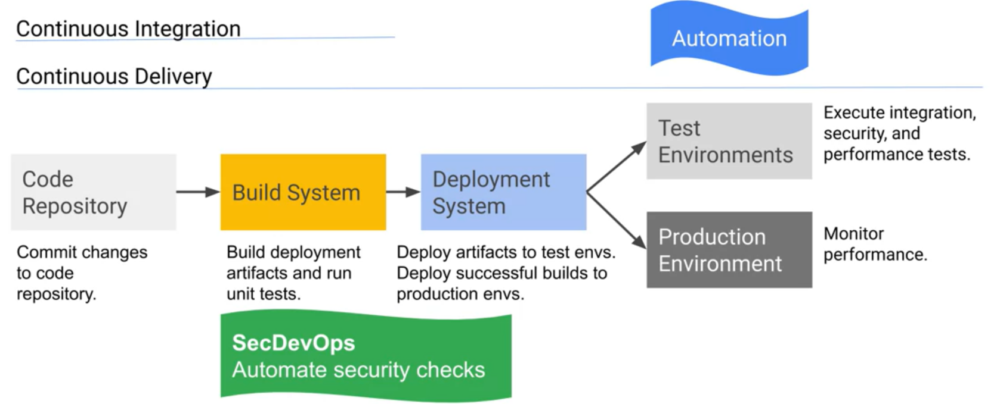

# Best Practices for Application Deployment II

## Use Federated Identity Management

* Delegate authentication to external *identity providers*.
  * Google, Facebook, and Github are a few trustable organizations that provide user authentication.

__Benefits:__ The developer won't have to implement, secure, and scale a proprietary solution for authenticating users.

- - - -

## Implement Health-Check Endpoints

* Implement a health-check endpoint for each service. The endpoint handler should check the health of all *dependencies* and *infrastructure components* required for proper functioning.
  * **Good Practice:** Use **Google Operations** **Load Balances** to periodically send requests to health-check endpoints.

* Evaluate which dependencies are critical enough to result in a health check failure.
  * **Good Practice:** Applications should respond to non-critical health failures instead of returning an error.

__Benefits:__ It's always important to monitor the status of applications and services to ensure they're always available and performing optimally. Data being monitored can be used to alert operation teams as soon as the system begins to fail.

- - - -

## Setup Logging

* Treat information logs as *events*. 
  * **Good Practice:** Dont manage logs within an application, but write them out to event streams such as *standard out*.

* **Google Operations** can be used to *debug applications*, setup *error monitoring*, setup *information logging* and *log-based metrics*, *trace requests* across services, and *monitor applications* running in a multi-cloud environment.

__Benefits:__ The developer can set up log-based metrics and determine where the system is failing or inefficient.

- - - -

## Handle Transient and Long-Lasting Errors Gracefully

* Applications should have *retry logic* with *exponential backoff*. 
  * **Good Practice:** Use the *Cloud Client Libraries* to retry failed requests automatically. 

* Applications should have a *circuit breaker* for graceful failure handling.

* Errors propogated to a user should *degrade* an application instead of *explicitly displayed*.
  * **Good Practice:** Similar to health-check failures, the application should deal with user errors instead of displaying an error message.

__Benefits:__ Applications will be resilient to temporary and long-lasting errors. Failing instances of applications won't be as resource-intensive and will have a lesser impact on application users.

- - - -

## Perform High Availability Testing & Develop Disaster Recovery Plans

* Identify failure scenarios and create disaster recovery plans that identify people, processes, and tools for disaster recovery.

* Perform *tabletop tests*.
  * Involves discussion, without implementation or practice, regarding what needs to be done during unexepcted situations.

* Simulate failure scenarios in the testing environment to refine the disaster recover plan.
 * **Good Practice:** Perform *canary testing* and use *blue/green deployments* in the production environment.

__Benefits:__ Will enable developers to develop robust recovery plans and prevent general panic during unexpected situations.

- - - -

## Implement a Strong DevOps Model

- - - -

## Use the Strangler Pattern for Re-Architecture

* The *strangler pattern* involves incrementally replacing components of an older application with new services.

* Use *strangler facades*, which receive requests and direct them to older versions of an application until the newer versions are implemented.

* When architecting the new application, make sure to follow *data sovreignty* and *compliance requirements* that differ by region.
