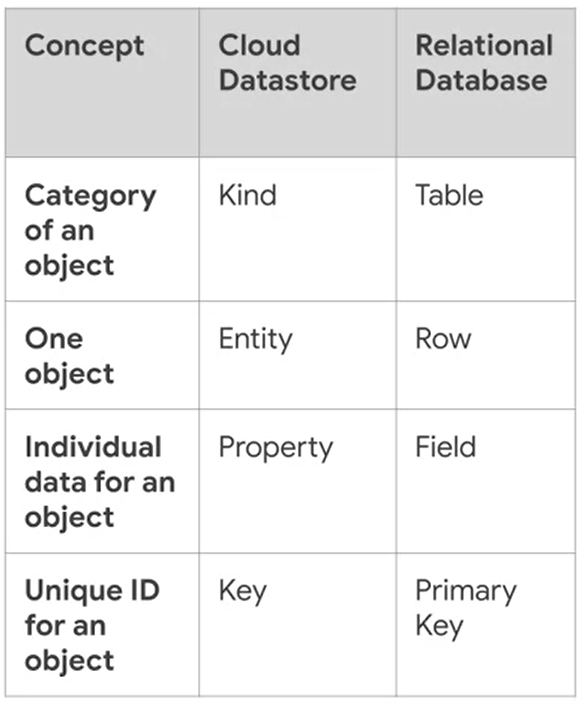
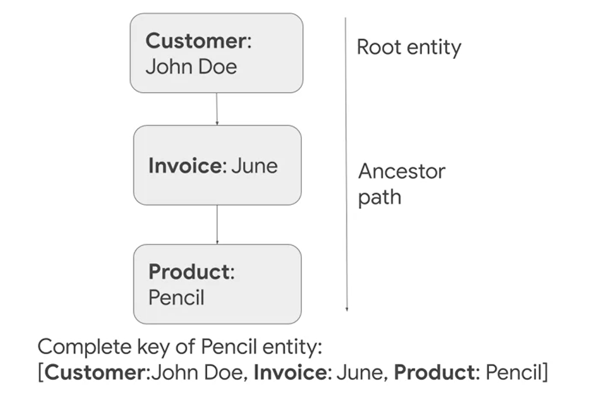
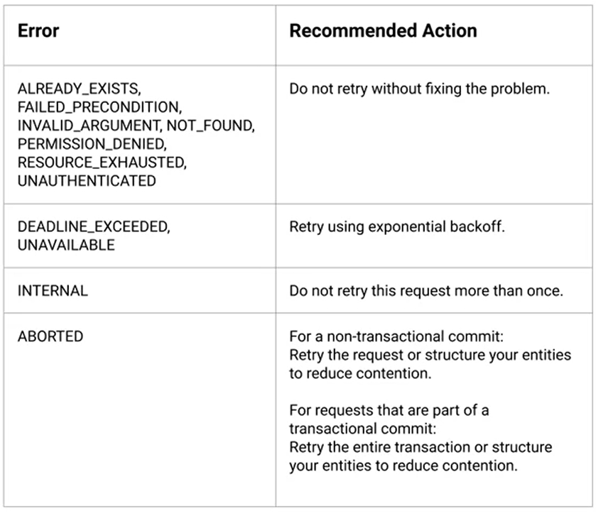

# Cloud Datastore

## Term Differences



- - - -

## Entity Keys & Ancestory

*Entity Keys* in **Cloud Datastore** are composed of:
  * Namespace
  * Entity Kind
  * Identifier (String or Numeric ID)
  * Ancestor Path (Optional)

When *Entities* are created, an ancestor entity can be specified for the element, which are similar to **Mongoose** links. This will ensure strong consistency when querying data.

 

- - - -

## Index Types

**Cloud Datastore** *Kinds* operate based on two types of indexes:

* **Built-In Indexes:** Pre-defined indexes for each property. They're suitible for equality-only queries or single-inequality queries.

* **Composite Indexes (Manual Indexes):** Required for more complicated queries that involve equality-only search parameters combined with a single inequality based search. They're defined in the *index.yaml* configuration file and are viewable, but not editable, through the **Cloud Platform Console**.

- - - -

## Modifying *index.yaml*

Changing index properties doesn't necessarily follow changing a single file and having the **Cloud Datastore** database replicated it. Instead, there are two separate commands for adding and removing indexes. Once *index.yaml* is modified:

```
  gcloud datastore create-indexes
```
Creates indexes that are present in the *index.yaml* file, but not in the *Kind*.
   
```
  gcloud datastore cleanup-indexes
```
Deletes indexes that aren't present in the *index.yaml* file, but present in the *Kind*.

- - - -

## Unavailable Operations

* Joint Operations
* Inequality Filtering on Multiple Properties
* Filtering on Subquery Results

- - - -

## Error Handling



- - - -

## Important Practices

* If a property will never be needed for a query, the property should be excluded from indexes. Unecessarily indexing a property could result in increased latency and increased storage cost.

* **Cloud Datastore** divides *Entities* among servers into *Entity Groups*, but the *Entities* within a *Kind* are still sorted in ascending order based on *Entity Keys*. As a result, *Keys* that *monotonically increases or decreases* with each *WRITE* command will cause all operations to be performed by a single server: this will be the server that stores either the starting or ending portion of a *Kind*. Such a server is called a *hotspot* and can be avoided by letting **Cloud Datastore* automatically create the key or generate *Key IDs* using the allocateIds() method.

* The maximum *WRITE* and *READ* rate to an *Entity Group* is 1/second. *Entity Contention* occurs when an *Entity Group* is updated rapidly; as a result, **Datastore** will queue concurrent requests and eventually thrown *timeout errors*. If there is a particular region of data that will experience large *WRITE*/*READ* traffic, that region can be manually *sharded*/*replicated*.
  * **Sharding:** Paritioning *Entities* among various servers. 
  * **Replication:** Making several copies of an *Entity* and partitioning the copies among various servers.

* Each HTTP request to **Cloud Datastore** has *transactional overhead*. By grouping multiple *WRITES* and *READS* in a single request, all operations will be treated as atomic and have the same *overhead* as a single operation. Operations can be grouped by using *Transactions* or *Batch API*.
  * Roll-back failed *Transactions* for minimal retry latency.

* **Cloud Datastore** supports *Query Cursors* that should be used in place of *Offsets*. *Query Cursors* allow an application to retrive a query's results without in convinient batches without incurring the overhead from *Offsets*.
* 

* Don't use *forward slashes* (/) in *Kind* names and custom *Key* names; the syntax could interfere with future **Cloud Datastore** functionality.