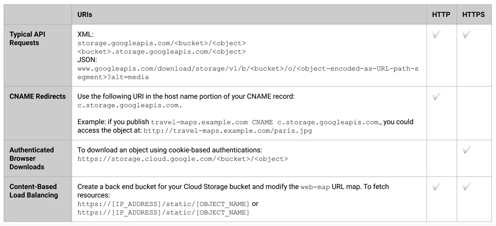
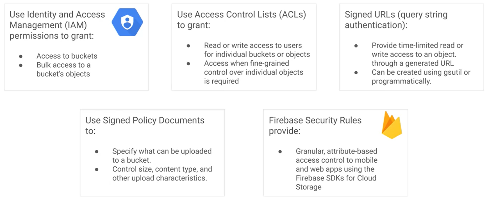

# Cloud Storage

## Strongly Consistent Operations

Once *Strongly Consistent Operations* are completed, the object they were modifying will be immediately available for download and metadata operations from any Google servicing location. These operations are:

* Read-after-Write
* Read-after-Metadata-Update
* Read-after-Delete
* Bucket Listing
* Object Listing
* Granting Resource Access

- - - -

## Eventually Consistent Operations

When *Eventually Consistent Operations* are performed, it may take some time for them to take effect: up to a minute. These operations are:

* Revoking Resource Access
* Accessing Publicly-Available Cached Objects

- - - -

## Cloud Storage Request Endpoints

__NOTE:__ Web Applications using JS must have *CORS* configured to sucessfully retrive data from **Cloud Storage** *Buckets*.

- - - -

## Composite Objects

*Composite Objects* consist of smaller objects that are combined. **Cloud Storage** allows the user to combine a maximum of 32 objects into a *Composite Object*. This can be helpful when uploading data, as large files can be split into smaller chunks that are uploaded to the server in parallel and re-combined into a *Composite Object*.

- - - -

## Truncated Exponential Backoff

A standard error-handling strategy for network applications. Client periodically retries a failed request with increasing delays. Should happen for HTTP 5xx and 429 response codes. Necessary if using GCP Cloud Storage XML or JSON API.

- - - -

## Bucket Security

- - - -

## Best Practices

* *Bucket* names must be unique across the **ENTIRE** service and should conform to standard DNS naming conventions.
  * *Bucket* names can appear in a DNS record as part of a *CNAME* redirect.

* *Cache-Control* can be specified to store applicaion data on internet and browser caches; in return, this will lower read latency. 

* If it is detected that progress has been stalled when using *XMLHttpRequests* for uploading data, the connection shouldn't be re-opened. This will create a bad positive-feedback loop during times of network congestion because the resulting *XHR* callbacks will get backlogged behind the acknowledgement activity from the upload stream.

* **Compute Engine** instances used to upload data should be located in the same region as the *Bucket* to prevent cross-region traffic.

* *OAuth2.0* tokens and customer-supplied encryption key information in the *.boto* configuration file are security-sensitive information that should have restricted access.

* Data can be corrupted during upload or download, so it should be validated by using *CRC32c* or *MD5* checksums.
