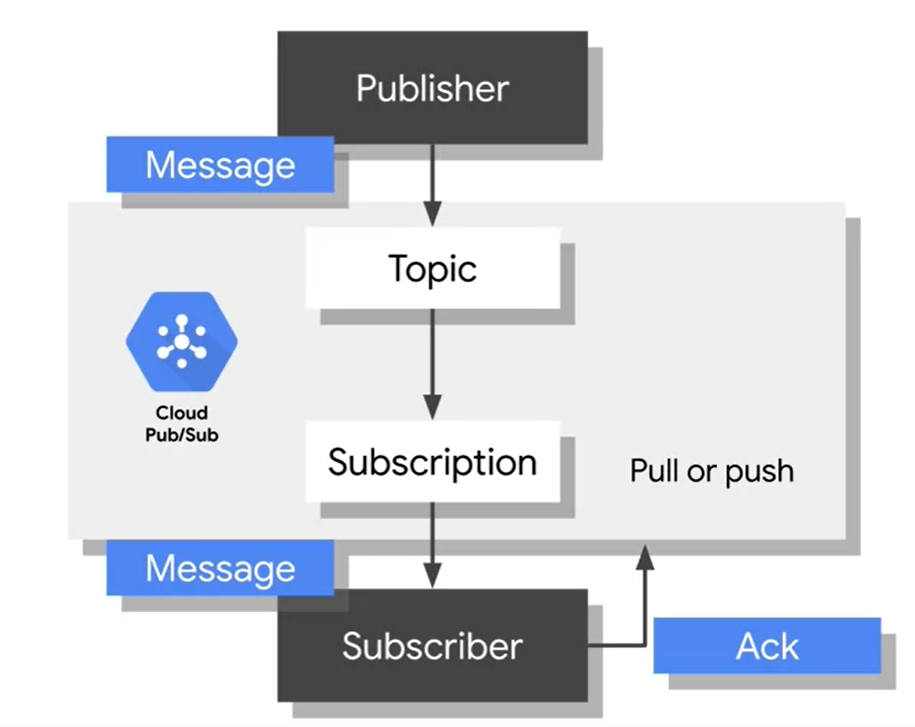
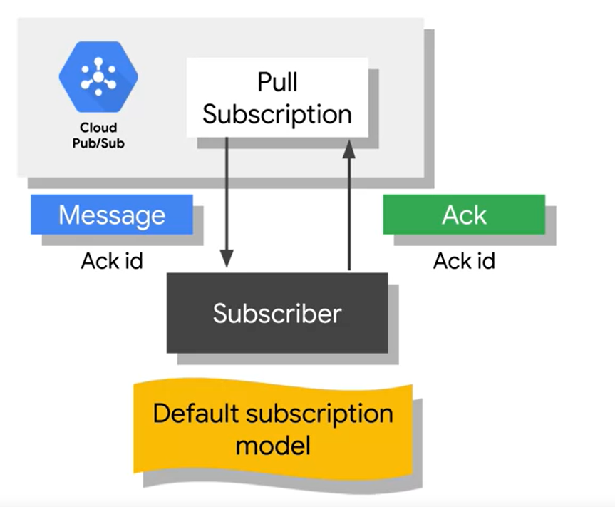
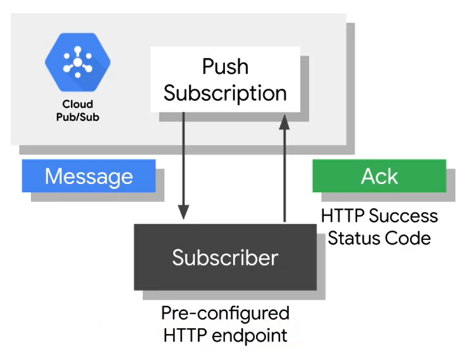
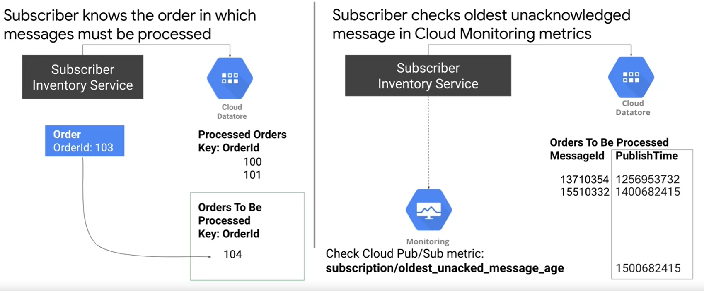
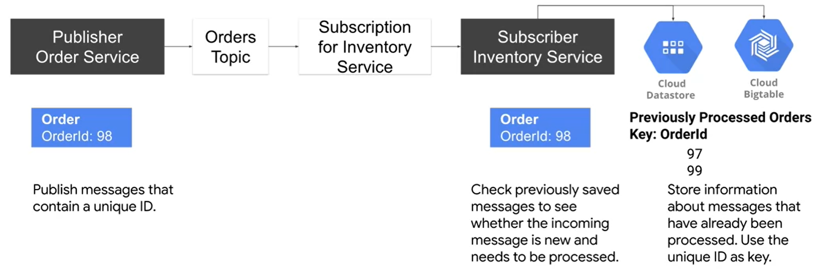
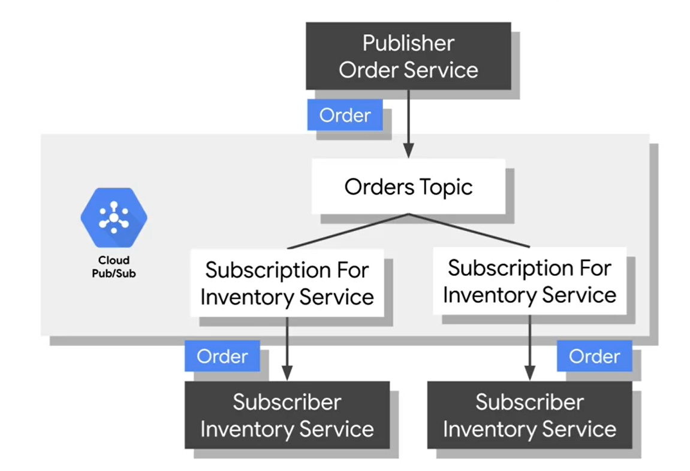

# Cloud Pub/Sub

While Cloud Pub/Sub was designed for *stream analytics*, it can be used to asynchronously integrate various parts of an application that span from GCP-based architectures to open multi-cloud or hybrid architectures.

## Example Use Cases

* Real-Time Gaming Applications
* Clickstream Data and Ingestion Processing
* Device or Sensor Data Processing
* Integrating Various Data Sources

- - - -

## Structure

**Pub/Sub** sends messages *at least once*, to there's a chance that messages may be duplicated. If the *Subscriber* doesn't acknowledge a message before the *acknowledgement deadline*, **Pub/Sub** will resend the message to the *Subscriber*.

- - - -

## Subscription Type

**Cloud Pub/Sub** uses *Pull* and *Push* subsriptions, which use the *polling* and *webhook* networking processes respectively.

### Pull Subscriptions

#### Process

1. The *Subscriber* explicitly calls a *pull* method to request messages. 
2. **Cloud Pub/Sub** will return the published messages with an acknowledgement ID. 
3. The subscriber will invoke the *acknowledgement* method and pass in the *Acknowledgement ID*.

#### Notes

* The *Pull Subscription* is used when needing to process a large volume of messages with high throughput. The topic can act as a buffer by storing the data, while the subscription can retrive information as an acceptable pace.

* The *Subscriber* has to use the *Google Cloud Client Libraries*.

* The *Subscriber* can modify the acknowledgement deadline.

- - - -

### Push Subscription

#### Process

1. Each message published by the *Publisher* is sent as an HTTP request to the *Subscriber* at a pre-configured HTTP endpoint. The endpoint an be a *Load Balancer* or **App Engine Standard** environment.

2. Depending on how the message was received, the *Subscriber* will return a correpsonding *HTTP Status Code* that represents the *Subscriber's* acknowledgement.

#### Note

The *Push Model* is used when Google Cloud dependencies and the *Cloud Client Library* can't be configured, or when multiple topics must be processed by the same web hook.

- - - -

## Meeting Application Needs

### Maintaining Message Order

In order for **Pub/Sub** to maintain fast message delivery, it can't guarantee that messages will appear in the order they were sent. By using **Cloud Datastore** to store messages temporarily, the *Publisher* can send messages with an order ID and the *Subscriber* can focus on processing messages that have incremental order IDs.

### Preventing Duplicate Messages

As stated before, **Pub/Sub** may possibly send the same message more than once to a *Subscriber*. This can be fixed by having unique IDs attached to each message; the unique IDs will then inform the *Subscriber* that certain messages have been processed.

### Fanning Messages

When multiple *Subscribers* are subscribed to the same topic, they will join the same *Subscription* service by default and messages will be split between them. For each *Subscriber* to receive every message send by the *Publisher* or *Publishers*, individual *Subscription* services must be created for each *Subscriber*. 