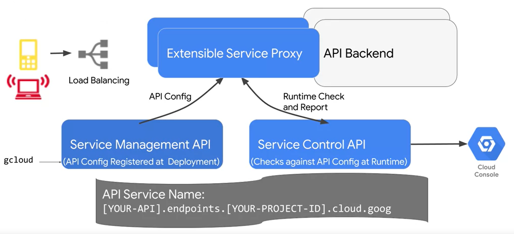
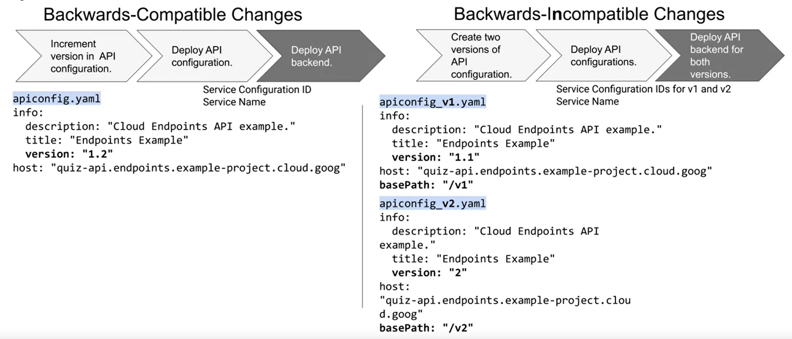

# Cloud Endpoints

**Cloud Endpoints** is a distributed API management system that is used to easily expose an API to trusted developers. It does this by deploying a proxy in front of a developer's software service. **Apigee Edge** is a great alternative to **Cloud Endpoints** for the purpose of serving legacy applications.

- - - -

## Features

* APIs are easy to log and monitor through **Google Operations**. 

* Provides a single coherent way to manage acces and know which end user is making calls to the APIs.

* Provides an API console to wrap up the capabilities in an easy-to-manage interface.

* Supports runtime environments from the **App Engine Flexible Engine**, **Kubernetes Engine**, and **Compute Engine**.

- - - -

## Specification

To integrate the API with **Cloud Endpoints**, the API architecture needs to be specified using the *Open API* specification in a *YAML* file. The YAML will contain:

* **Surface of the API**: Consists of the function name and parameters.

* **Security Defintions**: Can be specified to provide *user authentication* and *Service-to-Service Authentication*. 

There are many tools available to configure the *YAML* file: *Swagger Tools & Integrations*, *Swagger Editor*, and the *Open API Swagger Resource List*.

- - - -

## Structure

When the API configured, it's registered with the *Service Management API* and shared with *Extensible Service Proxy*. The *Service Management API* then uses the host value in the deployment configuration file to create a new **Cloud Endpoint** service. When the application is running, the *API Backened* will be used to provide functionality and the *Service Control API* will be used for monitoring.

- - - -

## Authentication

### User Authentication

**Cloud Endpoints** supports user authentication with **Firebase**, **OAuth2.0**, **Google Authentication**, and other custom authentication message. Once a user signs in, the authentication provider will send a signed JSON web token to **Cloud Endpoints**. **Cloud Endpoints** will then then check that the token is signed by the provider specified in the *YAML* file.

### Service-to-Service Authentication

*Service-to-Service Authentication* is necessary for **Cloud Endpoints** to access the API backend. 

- - - -

## Versioning

When making a *backward-compatible* change, the version number of the API needs to be changed before redeploying the application. If the change isn't *backward-compatible*, it may be a better idea to deploy a different version of the API.

- - - -

## Documentation

The **Cloud Endpoints Portal** can be used to create developer portals: websites that the API users can access to explore and test APIs. The documentation is powered by **SmartDocs**, which providers users with the *Try this API* panel that allows them to interact with the API without leaving the documentation.