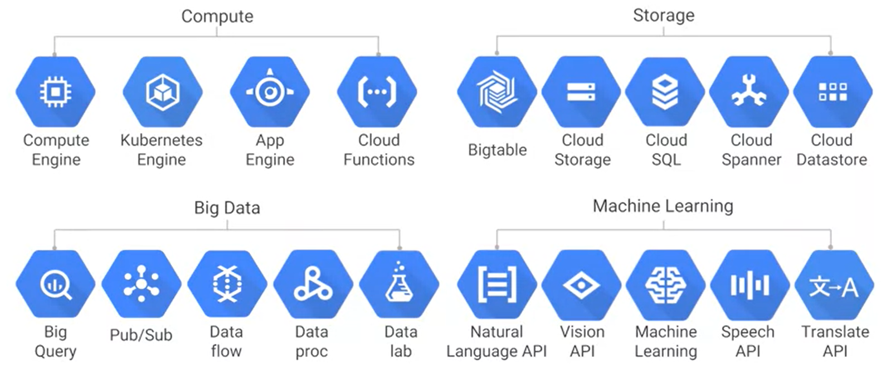
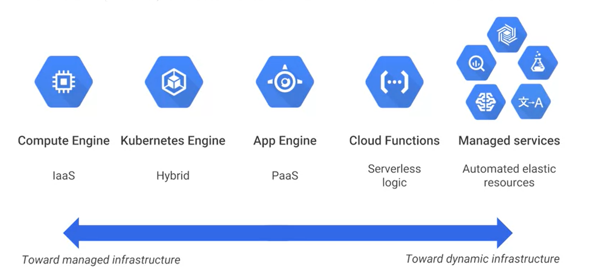
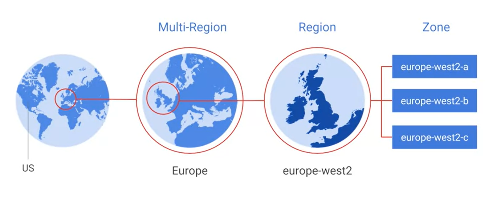

# Interacting with Google Cloud

## Google Cloud Services

The various services offered by *Google Cloud* ranged from **managed** to **dynamic** infrastructure:

A common problem that often arises when using cloud services is *Cloud Lock-In*. This invovles customers being reliant on a single cloud provider because they cannot easily move to a different provider without substantial costs, legal constraints, or technical compatibilities. What makes GCP preferable regarding this topic is that the services uses many open-source packages, software, and languages to build their platform. Additionally, they offer cross-platform services. This makes switching providers or using GCP along with other providers a more simplistic process. 

- - - - 

## Interacting with GCP

There are 4 main ways to interact with GCP:

### Cloud Platform Console

The *Cloud Platform Console* is the web-based UI that users are presented with when they log into GCP. The *Cloud Shell* can be accessed through the console.

### Cloud Shell and Cloud SDK

The *Cloud Shell* is a temporary VM that comes with the GCP *SDK* installed. This allows the user to manage GCP through a CLI without having to go through the hassle of installing the necessary packages. The *SDK* consists of three main services: 

* *gcloud* (Google Cloud)
* *gsutil* (Cloud Storage)
* *bq* (BigQuery)

### RESTful API

There are many older *Google API Client Libraries* and newer *Cloud Client Libraries* that allow the user to programatically develop GCP applications. Additionally, the *APIs Explorer* is an interactive tool available through the *Cloud Platform Console* that helps the user easily try using Google APIs using the browser. 

__NOTE:__ Community-provided APIs that expand on GCP functionality are available on the *Cloud Marketplace*.

### Cloud Console Mobile App

Allows for the management of GCP resources, such as VM and databae instances. The user can build a dashboard similar to the one provided by the *Cloud Platform Console*.

- - - -

## Location-Based Servicing

As like many other cloud providers, *Google Cloud* has many data centers across the world that are categorized into zones and regions:

| Gelocation   | Service |
|--------------|---------|
| Zone         | A deployment area for GCP resources. A zone doesn't always consist of a single building.|
| Region       | A grouping of zones into independent geographic areas. Zones within regions have fast network connectivity and round-trip network latencies of under 5 milliseconds. Resources can be spread across multiple zones in a region for improved fault tolerance. |
| Multi-Region | A grouping of regions. This grouping is used by a few select services, such as Cloud Storage, to store resources redundantly in 2 or more datacenters. Fault tolerance and access speeds will be improved.|