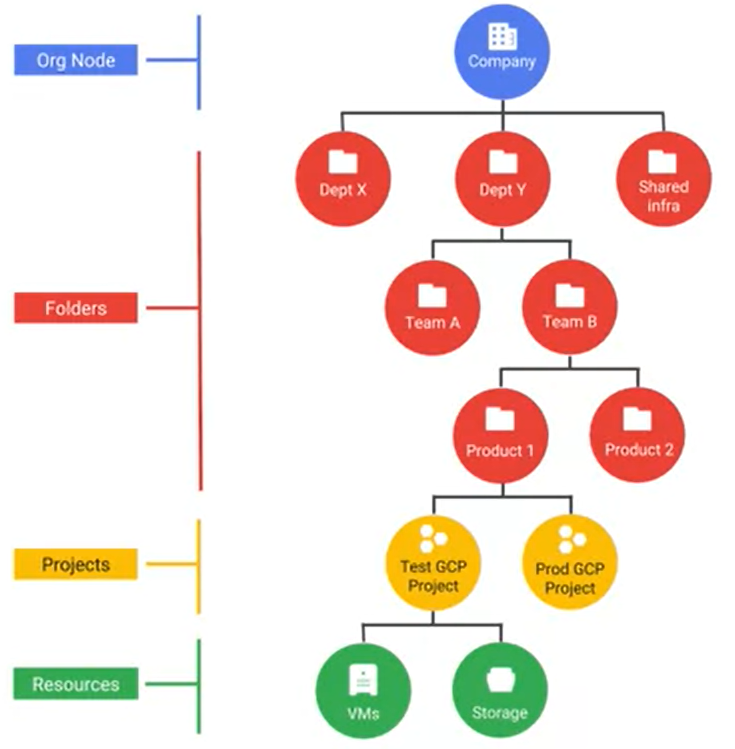
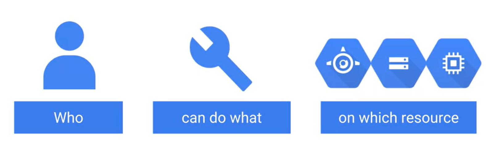
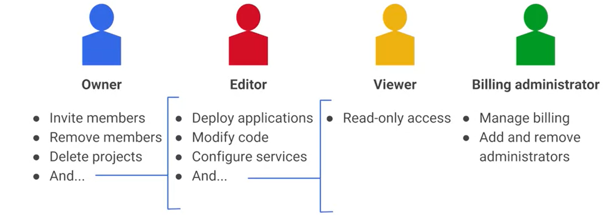

# Security

## GCP Structure

### Resource Hierarchy

### Projects

Projects are created for fulfilling the individual goals of an organization, with services and *APIs* being enable on a per-project basis. Projects specifically have an *ID*, *name*, and *number* assigned to them:

| Idenfitication | Unique? | Assigned By | Mutable? |
|----------------|---------|-------------|----------|
| Project ID     | Yes     | User        | No       |
| Project Name   | No      | User        | Yes      |
| Project Number | Yes     | GCP         | No       |

### Folders

Folders are used to group projects under an organization. While the provide easier navigation, *IM policies* can be assigned to folders to grant access rights to multiple projects at once.

### Organization Node

An organization node must exist at the top of the hierarchy to use folders. The organization node lets the user view how all resources are being used and apply IM policies centrally. If the company has a *GSuite* domain, all projects will automatically be grouped under an organization node. Else, the node will have to be manually created.

- - - -

## Identity and Access Management (IM/IAM)

**IM** controls accessbility for all users regarding GCP *projects*. GCP controls the lower layers of security, such as the physical security of hardware and the encryption of data on disk. Alternatively, users have control over the higher level of security, mainly being the access restrictions of each user.

### Structure

#### Who

**IM** allows various selectors for GCP users, which are Google accounts, Google groups, service accounts, the entire G Suite, or a Cloud Identity Domain. 

#### Can Do What: Roles

After selecting *who*, the *who* can be assigned a *role*. There are 3 specific types of roles:

| Role       | Function |
|------------|----------|
| Primitive  | Broad roles that apply across all GCP services in a project.                                                |
| Predefined | More fine-grained roles that apply to a particular GCP service.                                             |
| Custom     | Roles that contain a set of user-defined permissions that can be assigned at the project or organization levels. |

The 4 types of *primitive roles* are:

### Can Do What: Permissions

A *role* is a group of permissions. *Custom Roles* can be defined to assign specific, individual permissions to a *who*. Permissions appear in the form of:

> \<service>.\<resource>.\<verb>

For example, a user who needs to execute the *publisher.publish* method needs a permission that is defined as: *pubsub.topics.publish*.

- - - -

### Predefined Priviledges

When assigning various people roles, it is important to follow the *Principle of Least Priviledge*. This principle states that each user should only have the privledges that allow them to do their job. As a result, it is important to keep in mind how GCP assigns predefined priviledges:

1. The more generous policy assigned to users will be the one that takes effect; this will be true regardless of where the policy was assigned in the hierarcy. 

2. Folders, projects, and resources will inherit relavent parent policies unless specified otherwise.

- - - -

### Service Accounts

__Usage:__
A service account is mainly used in two scenarios:

* Providing Google services and VMs with automated authentication to access Google APIs.
* Acessing Google services, using the OAuth 2.0 protocol, with user-level IM policies to assist end-level users.

__Service Account Syntax:__
* *PROJECT_NUMBER*`-compute@developer.gserviceaccount.com`
*  *PROJECT_ID*`@appspot.gserviceaccount.com`

__Key Features:__

* Service accounts are treated as resources, so **IM** policies can be attached to them.
* Service accounts are associated with *RSA Key Pairs* that can be used to interact with them.
  * *Key rotation* is automatically performed by Google.
* External keys can be provided if needed.

