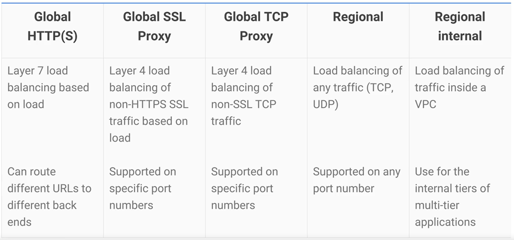

# Networking

## Virtual Private Cloud Network (VPC Network)

*VPC Networks* connect GCP resources to each other and the internet.

__Features:__
* The networks can be segmented.
* Firewall routes can be used to restrict access to instances.
* Static routes can be created to forward traffic to specific destinations.

### Layout

__NOTE:__ A *Subnet* stands for a *subnetwork*, which is the result of a logical subdivision of an IP network. 

* *VPC Networks* are global in scope. 
* *Subnets* can be created in any GCP region.
* *Subnets* can span across the zones in a region.
* Resources on the same *Subnet* can be allocated in different zones.

### Routing Traffic

*VPC Networks* have built-in routing tables that forward traffic from one instance to another in the same network, subnet, or GCP zone without requiring an external IP address.  

They also have a globally distributed firewall that allows the user to restrict incoming and outgoing traffic to/from instances. The firewall rules can be defined by using metadata tags on *Compute Engine* Instances.
> __EX:__ Traffic on certain ports can have access to VMs with the 'web' tag regardless of their IP address. 

- - - -

## Network Interconnectivity

Developers may want to connect their *On-Prem* networks, networks provided alternative cloud providers, or other GCP networks to the current *VPC Network*. There are many options for this:

### VPC Peering

Allows *VPC Networks* in different projects to route traffic between each other. The resources in the two projects are able to interact as though they were in the same network. The service includes **Shared VPC**, which allows for the implementation of *IM Policies* across a *Peering Network*.

### VPNs

Networks can connect through a VPN using *IPsec (Internet Protocol Security)*. The GCP **Cloud Router** feature allows the networks to exchange routing information using the *Border Gateway Protocol*.

### Direct Peering

Developers may not want to connect to GCP through the internet due to security concerns or the lack of a reliable bandwidth. They will instead be able to form a private connection with Google through **Direct Peering**, which is the process of establishing a network between two parties. 

### Carrier Peering

Google has 100 points of presence around the world through which **Direct Peering** can be established, but developers who aren't in a point of presence can contract with a partner company in the **Carrier Peering** program to get connected instead.

### Dedicated Interconnect

Involves establishing a direct, physical connection between the on-prem network and a Google datacenter for private cloud traffic to Google Cloud.

- - - -

## Paid VPC Services

### Cloud Load Balancing

__NOTE:__ An *Anycast IP Address* results from a collection of servers sharing the same IP address.

A service that automatically manages incoming and outgoing traffic by providing the users of a GCP application with an *Anycast IP Address*. The service involves *Cross-Region Load Balancing*, which moves traffic to different zones and regions depending on backend health, network conditions, and other related conditions. The practice of moving traffic based on an unhealthy backend is called *Automatic Multi-Region Failover*. **Cloud Load Balancing** also offers much more cross-regional load balancing options:

### Google Domains DNS & Google Cloud DNS

A *DNS* translates host names to addresses, but most users aren't able to directly use the *DNS Root Servers*. Instead, a company like Google can connect to the *Root Servers* and create their own *DNS* that users can use. Small-scale applications can use **Google Domains DNS**, while large-scale applications can use **Google Cloud DNS**. **Google Cloud DNS** has a lower latency and serves data from redundant locations around the world, but doesn't handle *Domain Registration*. As a result, it can be used in conjunction with **Google Domains** or some other domain provider. 

*Google DNS* IPv4 address: **8.8.8.8**

### Google Cloud CDN

__NOTE:__ *Edge Caching* is the process of caching servers to store content closer to end users. 

Google has a global system of *Edge Caches* that can be utilized though the **Google Cloud CDN**. If a developer wants to use a different *content-delivery network* to provide their application, it is most likely tied to *GCP* through Google's *CDN Interconnet Partner Program*.