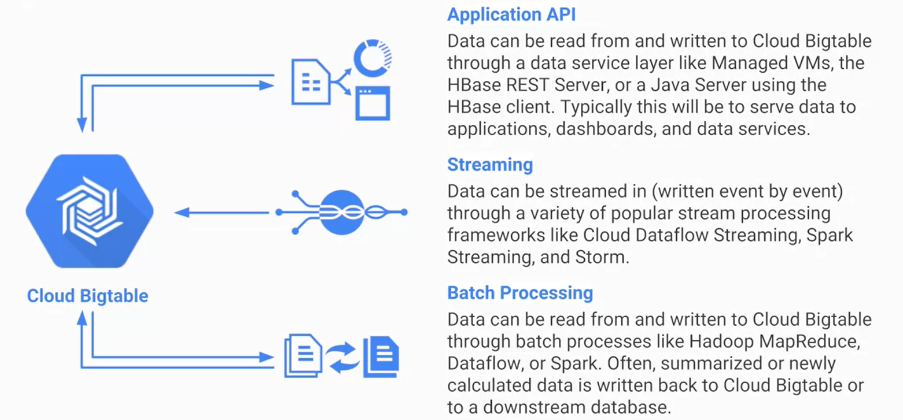
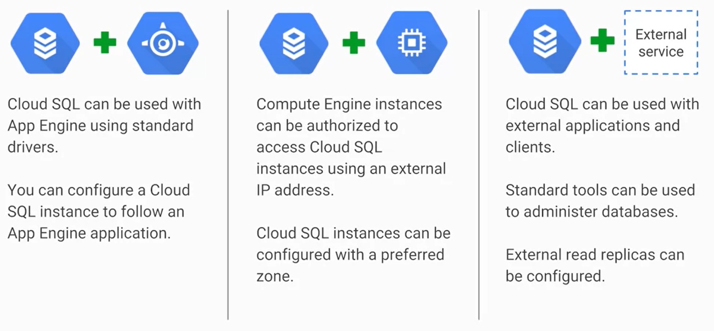

# Intra-Region Storage

__NOTE:__ All Google Services can be used across multiple regions. **Cloud Bigtable** and **Cloud SQL** are chosen to intra-regional because they aren't optimized to serve high-value transactional data.

## Cloud Bigtable

Google's NoSQL, BigData, fully managed, database service based on **Apache Hadoop** and its *MapReduce* operations.

### Features

* Can be thought of as a *Persistent Hash-Table*. Ideal for storing large amounts of data with very low latency and high throughput. 

* Offered through the same open-source API as **HBase**, the native database for the Apache Hadoop project. This allows for the portability of applications between **HBase** and **BigTable**.

* *Scalability:* More entries in **HBase** will cause a slower rate of queries, but **Bigtable** can increase the machine count with no downtime.

* Treats administration tasks like upgrades, which allows it to restart transparently. 

* Data is encrypted in-flight and at rest. 

* **IM Policies** can be used to control  **BigTable** database access.

### Data Transfer Services

- - - -

## Cloud SQL

Provides the *MySQL*, *Postgre SQL*, or *Microsoft SQL Server* database engines as a fully managed service.

### Features

* Provides several replica services such as *read*, *failover*, and *external replicas*. If an outage occurs, **Cloud SQL** can replicate data between multiple zones with automatic failover.

* Has on-demand and scheduled backups.

* Can scale vertically by changing the machine type and horizontally via read replicas. *Vertical scaling* involves making currently available VMs more powerful, while *horizonal scaling* involves getting additional VMs.  

* Cloud SQL instances include network firewalls. Data is also encrypted when placed in Google's internal networks. It is once more encrypted when stored in database tables, temporary files, and cloud backups.

### Data Transfer Services

Examples of external applications that may be used by **Cloud SQL** are **SQL Workbench**, **Toad**, and other applications using standard MySQL drivers. 
