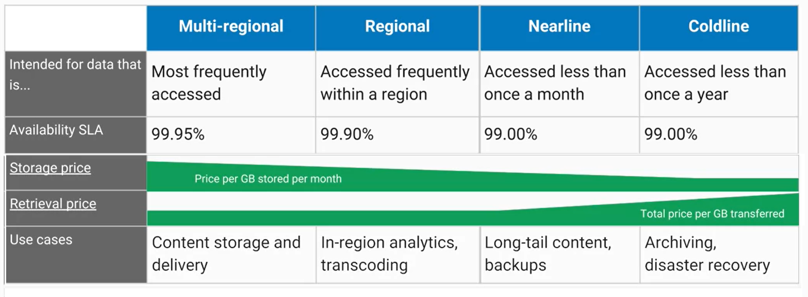
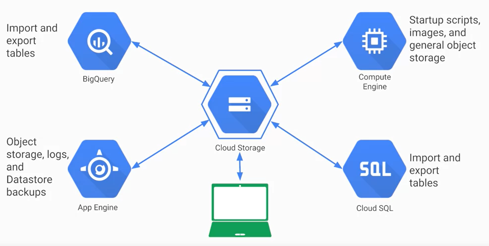

# Multi-Regional Storage

## Cloud Storage

**Cloud Storage** involves storing a URL and an object/binary data as key-value pairs. Due to the nature of the service, the developer won't need to provision capacity beforehand. The storage mechanism that holds relavent key-value pairs is called a *Bucket*. Each *Bucket* has a globaly unique name, geographic location, and storage class.

### Storage Classes

### Features

* Storage objects are immutable, so data is overwritten when making changes.

* *Object Versioning* can be turned on when creating bucket. As a result, Google will keep a history of modifications. *Lifecycle Management Policies* allow the developer to store object history for a certain period of time, which will prevent uwanted data from taking up storage.

* Data is encrypted server-side for no extra cost. Data in transit is encrypted using *HTTPS*.

* While *IM Policies* may sufficiently define access rights,*Access Control Lists* are more fine-grained and define who has access to certain *Buckets* and objects. Individual statements in an *ACL* consist of a scope and permission. The scope defines the individual user or group of users, while the permission defines the access rights that will apply to the users selected by the scope.

### Data Transfer Services

* **gsutil:** Developers can use this *Cloud Storage* command from the *Cloud SDK* to programatically send data. 

* **GCP Console:** Involves dragging & dropping data if using the Chrome Browser.

* **Storage Transfer Service :** Allows for the scheduling and managing of batch transfers from another cloud provider, cloud storage region, or HTTPS endpoint. 

* **Transfer Appliance:** A rackable, high capacity storage server that developers can physically lease from Google. The developers can then upload data to the server and ship it to a Google upload facility.

* **Data Transfer Through GCP Services:** 

- - - -

## Cloud Firestore/Datastore

**Cloud Firestore/Datastore** is a NoSQL database often used to store data from **App Engine** applications. It is also used as an integration point for applications that span across **App Engine** and **Compute Engine**.

### Features

* Automatically handles *Sharding* and *Replication*, which is essential for large horizontal scaling. *Sharding* involves breaking a database into segments.

* Offers transactions that affect rows across databases through a language called GQL, unlike **BigTable**.

* Has a free daily quota that allows for 1 GB of data storage and thousands of small operations to be performed per day.

- - - -
## Cloud Spanner

**Cloud Spanner** is a NewSQL database service. NewSQL databases seek to offer the scalable benefits of NoSQL databases while maintaining the traditional SQL structure.

### Features

* Automatically handles *Sharding* and *Replication*, which is essential for large horizontal scaling.

* Guarantees transactional consistency at a global scale.

* Offers petabytes of capacity.

- - - -

__NOTE:__ **Cloud Spanner** and **Cloud Firestore/Datastore** are created under the assumption that they will affect end-users around the world who interact with different GCP data centers. If writing to the database is implemented incorrectly, a single server can receive all the data and overload. Such a server is called a *hotspot*.