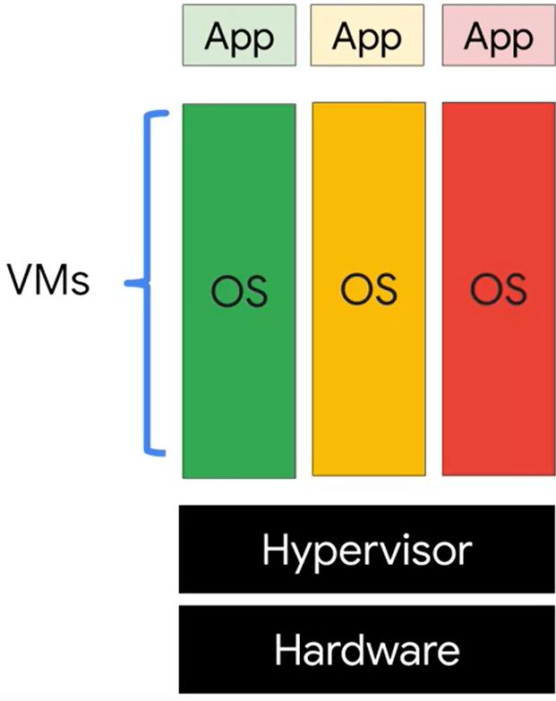

# Containers

## The Problem with Compute Engine & App Engine



If an application using **Compute Engine** has to scale in order to keep up with growing demand, the developer will have to reserve additional VMs. The problem with having multiple VMs is that each VM will contain an OS, which often takes up multiple gigabytes of storage, can take minutes to boot, and can take up precious computing power. As a result, resource consumption may grow faster than the developer would like. 


While **App Engine** will seamlessly scale based on growing demand, the user will lose complete access of the underlying server architecture.

- - - -

## Containers

*Containers* are and entire runtime environment, which consists of an application, application dependencies, libraries, and configuration files, bundled into a single, small package.

### Benefits

* Because of their small size, many *Containers* can usually fit into a single host. This will reduce the rate of resource consumption required by scaling applications.

* Due to having the entire runtime environment stored in a single package, differences in OS distributions and underlying infrastructure are abstracted away. This can be thought of as *virtualizing* the OS.

* The container is very portable and can be run on any hosting machine that supports *Containers* and a *Container* run-time. 

* A container starts as quickly as a new process, which is much faster than starting a new OS instance.

* The units of code running in containers can communicate over a *network fabric*, which is a fully interconnected network. This allows for applications to be modular; as a result, they will be easier to deploy and will also scale indpendently across a group of hosts.

- - - -

## Container Creation Example

There are many ways to build containers, the most popular way being using the traditional Dockerfile. This is because it is used by **Docker**, which is the first *Container Registry* service provider. **Google Container Registry**, which is part of the **Cloud Build** service, also supports *Dockerfiles*.

__Dockerfile:__
```dockerfile

    FROM ubuntu:18.10
    RUN apt-get update -y && \
        apt-get install -y python3-pip python3-dev
    COPY . /app
    WORKDIR /app
    RUN pip3 install -r requirements.txt
    ENTRYPOINT ["python3", "app.py"]

```

### FROM

```dockerfile
    FROM ubuntu:18.10
```

The **FROM** command defines the base used to install dependencies and package the runtime into a container. In the above example, the base being used is the Ubuntu OS.

### RUN

```dockerfile
    RUN apt-get update -y && \
        apt-get install -y python3-pip python3-dev
```
**RUN** executes OS shell commands. In this instance, it is being used to install the *Python* environment.

### COPY

```dockerfile
    COPY . /app
```

Offers the same functionality as the Linux *cp* command.

### WORKDIR

```dockerfile
    WORKDIR /app
```

Offers the same functionality as the Linux *cd* command, as well as the same functionality as the Linux *mkdir* command if needed.

### ENTRYPOINT

```dockerfile
    ENTRYPOINT ["python3", "app.py"]
```

Tells **Docker** how to run the application. The main file and its file type are specified.

- - - -

### Command Line Interface

```bash
    docker build -t py-server
    docker run -d py-server
```

The *build* command creates the **Docker** image, while the *run* command executes the image. In a real-world situation, the image will be stored in a *Container Registry* service.