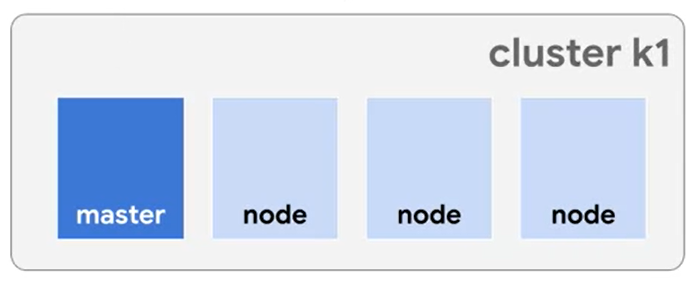
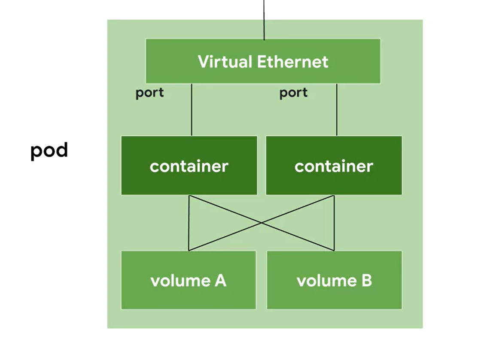
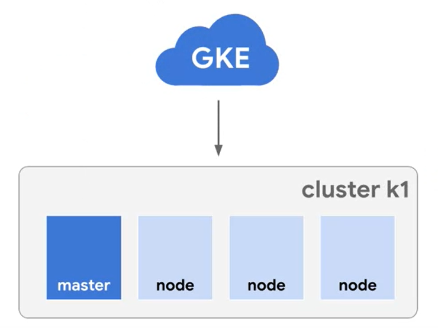
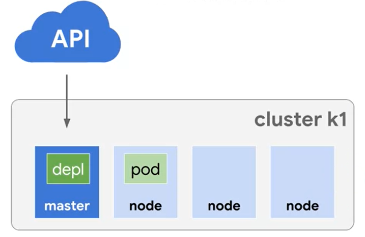
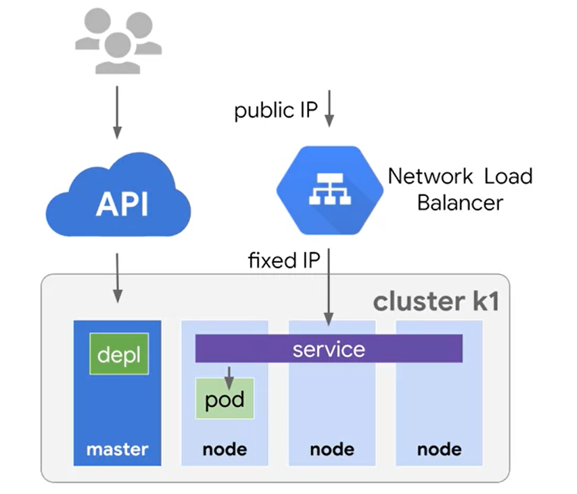
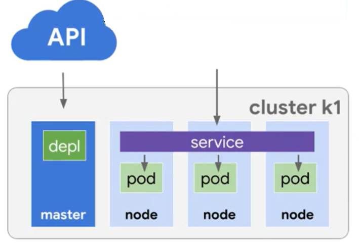

# Google Kubernetes Engine

**Kubernetes** is an open-source orchestrator for containers. Container orchestration automates the depolyment, management, scaling, and networking of containers. **Google Kubernetes Engine** is a cloud-based Kubernetes service that provides users with fully configured and ready-to-use containers. **Anthos** is a server management system that makes use of **Kubernetes** containers to help developers build, deploy, and manage applications that are hosted across different cloud services and on-prem networks; not just Google Cloud.

- - - -

## Structure

### Cluster

**Kubernetes** deploys containers using a *cluster*, which contains a set of *master components* that control the system as a whole and a set of *nodes* that run *pods*. **Clusters** can be created however the developer sees fit, but it most likely is good practice to use different clusters to solve different challenges.



### Node

A *node* is simply a computing instance. It may be able to only execute a single pod, but most instances are able to execute multiple pods at once. **Google Kubernetes Engine** creates *nodes* from **Compute Engine** VMs. 

### Pod

A *pod* is an abstraction that represents the process that executes a container or set of containers. It is the smallest deployable unit in Kubernetes. It could execute a component of an application, an entire application, or even multiple applications if the applications have a hard dependency. Clusters within a pod share networking and disk storage, as well as communicate to each other through the *localhost* network interface.



- - - -

## Using the Kubernetes API

### 1. Creating a Cluster __(GKE API)__



```bash
    gcloud container clusters create k1
```

Creates a cluster called *k1*.

### 2. Creating a Deployment



```bash
    kubectl run <deployment_name> --image=<image>:<version>
```

Creates a nginx web sever*Deployment*. A *Deployment* runs multiple, identical pods with no unique identity. This helps ensure that one or more instances of the pod is available to serve user requests. Not all pods will be assigned a node on the cluster.

### 3. Publicly Deploying Clusters



```bash
    kubectl expose deployments <deployment_name> --port=80 --type=LoadBalancer
```

While each *pod* in the cluster has its own unique IP address and a set of ports, these can only be used within the cluster. To publicly deploy a cluster, the pods within a cluster need to be grouped into a single resource through a *Service*, such as a *Load Balancer*.

### 4. Scaling a Deployment



```bash
    kubectl scale <deployment_name> --replicas=3
    kubectl autoscale <deployment_name> --min=10 --max=15 --cpu=80
```

Places more *pods* part of a *Deployment* into nodes. *autoscale* can be used to scale pods depending on CPU usage. In the above example, *pods* will be placed into nodes whenver the total CPU usage is over 80%. 

### 5. Applying Configuration Files

```bash
    kubectl apply -f <configuration_file>.yaml
```

The two main ways to manage clusters are through the **Kubernetes** API and configuration files. The above command applies a configuration file to a **Kubernetes** cluster. 

### 6. Viewing Cluster Information

```bash
    kubectl get pods
    kubectl get deployments
    kubectl get replicasets
    kubectl get services
```

*pod* displays information for each single pod, while *deployments* displays information for each single deployment. If there are replica pods from the same *Deployment* running on nodes, *replicasets* provides information on how many are desired and actually exist.  
The *services* will provide information regarding services such as *LoadBalancer*.