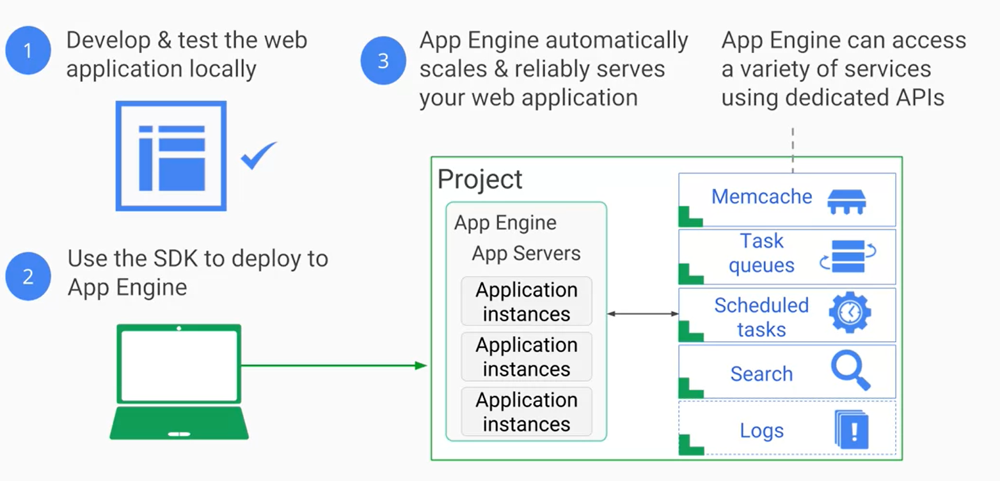
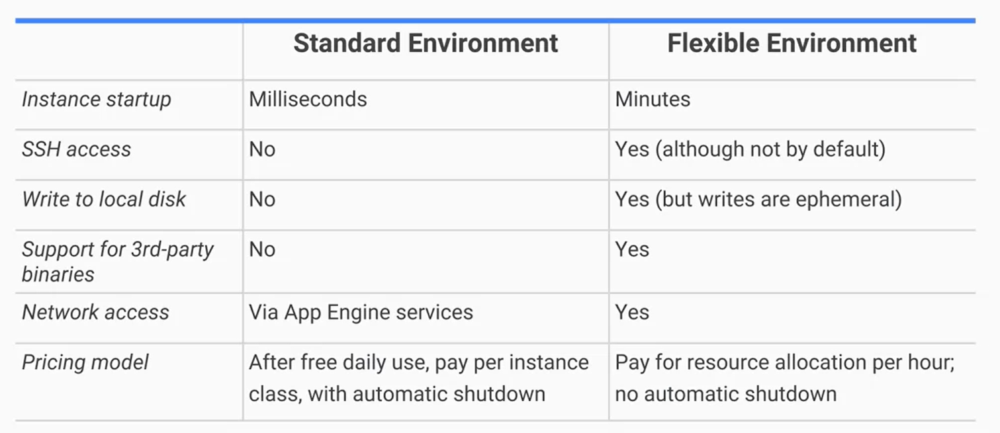

# Application Deployment

## Compute Engine

**Compute Engine** is an *IaaS* that allows users to run VMs on Google infrastructure.

### Features

* Google provides various Linux and Windows VM server images, as well as customized versions of these images. If these images aren't suited to personal needs, it is also possible to import images. 

* *Snapshots* can be taken from VM disks. They can be used as backups or for migrating a VM to another region.

* Developers can create *preemptive* VMs, which are VMs that **Compute Engine** has the right to terminate if resources are needed elsewhere. As long as developers can create jobs that are able to be stopped and restarted without problems, they can save money.

* Big VMs with over a 100 CPUs and memory sizes of 624 GB can be created for memory-intensive and compute-intensive applications. Alternatively, the *Autoscaling* feature can be turned on for *Managed Instance Groups*; this will allow for horizontal scaling by adding and removing VMs from an application based on load metrics.

- - - -

## App Engine

**App Engine** is a *PaaS* that handles the hardware and networking infrastructure required to run an application; it also provides developers with many built-in services that many website applications need. It will automatically scale and charge developers based on the resources used.  Note that only one **App Engine** instance can be created per project.

**App Engine** offers developers with two types of environments: *Standard* and *Flexible*.

### The Standard Environment

__Benefits:__
* Fine-Grained Autoscaling

* Free Daily Usage Quota 

* Offers a simpler deployment experience than the *Flexible* environment.

__Drawbacks:__
* Only works with specific versions of Java, Python, PHP, and Go.

* Code is run in a *sandbox*, which is a *container* that provides a highly isolated environment that nullifies security concerns. This means that a*sandboxes* don't offer persistent storage and need to be paired with a database service.

* Requests received by an application have a 60 second timeout.

* Arbitrary 3rd party software can't be installed.

__Workflow:__

### The Flexible Environment

__Benefits:__

* Runs using **Docker** containers on **Compute Engine** VMs that have persistent storage.

* Can choose which geographical region it runs in.

* Backward compatible updates to the underlying OS will be applied.

__Drawbacks:__

* Higher instance startup and deployment time.

* No access to certain **App Engine** services such as *Memcache*, *Users API*, and *Images API*.

### Environment Comparison

- - - - 

## Cloud Run

**Cloud Run** is a managed compute platform that enables the developer to run stateless containers that are invokable through HTML requests or **Cloud Pub/Sub** events.

### Features

* **Cloud Run** uses a *serverless* architecture, so the developer only has to develop the application container.
* Horizontaly and elastically scales the container images to handle incoming requests.

* **Cloud Run** can be accessed through **GKE** if the developer needs to specify the VPC resources needed or deploy containers to custom machine types.

* Built on top of **Knative**, the Kubernetes-based container deployment platform.